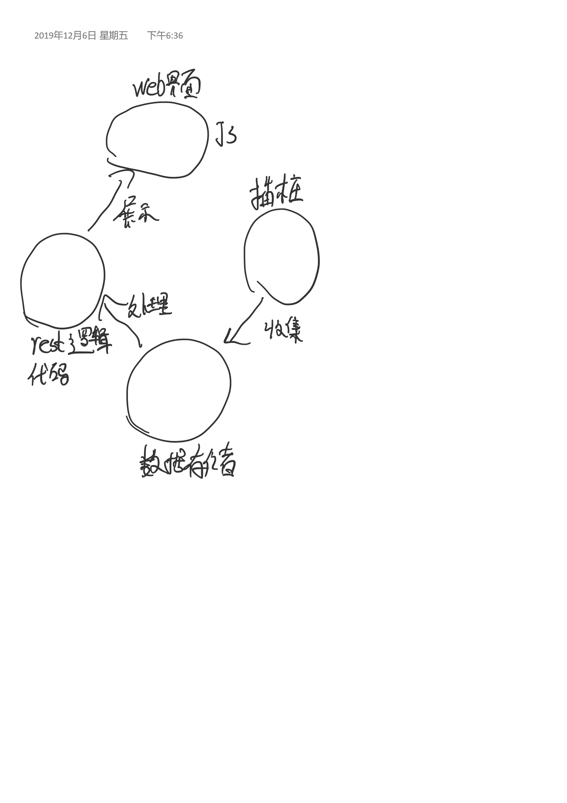

# 源代码运行时可视化跟踪

在阅读复杂代码时常常感觉到非常头痛, 想着可以可视化就好了,所以在想要做一个通用的工具实现我的目的.

# 计划

## 支持 python 单线程程序

### 目前的基本设想

web界面展示

## 支持 python 多线程程序

## 支持 python 多进程程序

# 模块划分

## web界面展示模块

django-rest 作为后端框架实现数据接口(读取数据储存模块信息处理成前端可以可视化处理的格式)

前端 待定

## 信息收集模块

插桩收集信息(初始版本不考虑性能,侵入性)---->传递给存储模块

保留拓展性----->以后支持更多的语言

## 数据存储模块

用mysql or redis

